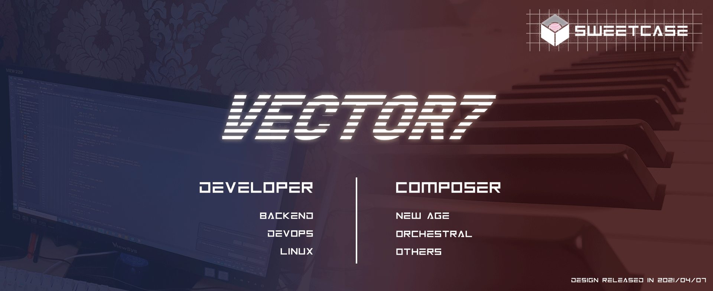

## Ha Jeong Hyun (Vector-7)
 
<code></code>
<code></code>
<code></code>

### Technology stack
* **Main**
  * Spring boot / Flask / MySQL / Redis
  * ReactJS
  * Linux(CentOS,Ubuntu) / terraform / firebase / docker
* **Other**
  * Graphic: Adobe Photoshop / Illustrator
  * Music: FL Studio / Musescore

